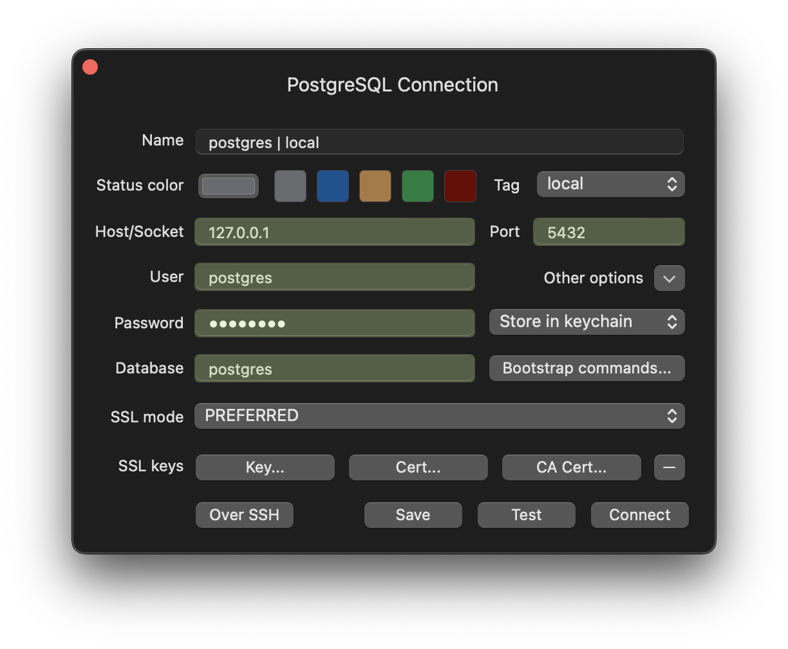
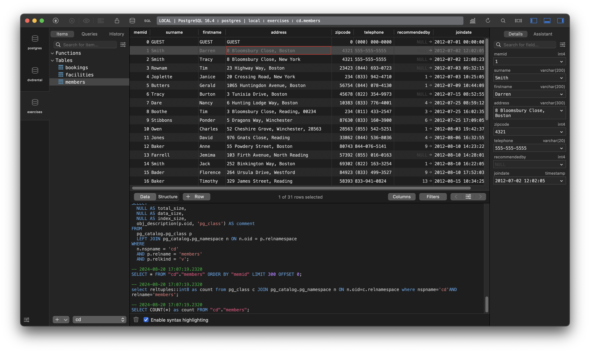

# SQL Bootcamp: Go from Zero to Hero

Loosely follows the Udemy course [The Complete SQL Bootcamp: Go from Zero to Hero](https://www.udemy.com/course/the-complete-sql-bootcamp/) led by instructor Jose Portilla.

## Minimum Requirements

* [docker](https://docs.docker.com/get-docker/)
* [python](https://www.python.org/downloads/)
* [pgadmin](https://www.pgadmin.org/download/)

## Recommended Requirements

* [devbox](https://www.jetify.com/devbox/docs/installing_devbox/)
* [TablePlus](https://tableplus.com/)

## Quickstart

* Clone the repository via `git clone https://github.com/pythoninthegrass/sql_zero_to_hero.git`
* Change into the directory via `cd sql_zero_to_hero`
* Copy `.env.example` to `.env` and update the values
* Run `docker-compose up -d` to start the PostgreSQL and Python containers
* Exec into either
    ```bash
    # python
    docker exec -it python-udemy bash

    # postgres
    docker exec -it postgres-udemy bash
    ```
* To exit the container, type `exit`, and hit `Return`
* Connect to the PostgreSQL container via either pgadmin or TablePlus
  * For the latter, it'll look like this:
    
    
* Once finished, run `docker-compose stop` to stop the containers
* To remove the containers, run `docker-compose down --volumes`

## TODO

* Test the [main.py](main.py) script. e.g.:
    ```bash
    λ docker exec -it python-udemy bash
    root@python-udemy:/app# ./main.py
    Traceback (most recent call last):
    File "/app/./main.py", line 24, in <module>
        cur.execute("SELECT * FROM payment")
    psycopg2.errors.UndefinedTable: relation "payment" does not exist
    LINE 1: SELECT * FROM payment
                        ^
    ```
* Complete course
* Organize sections with relevant SQL files and notes
